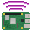
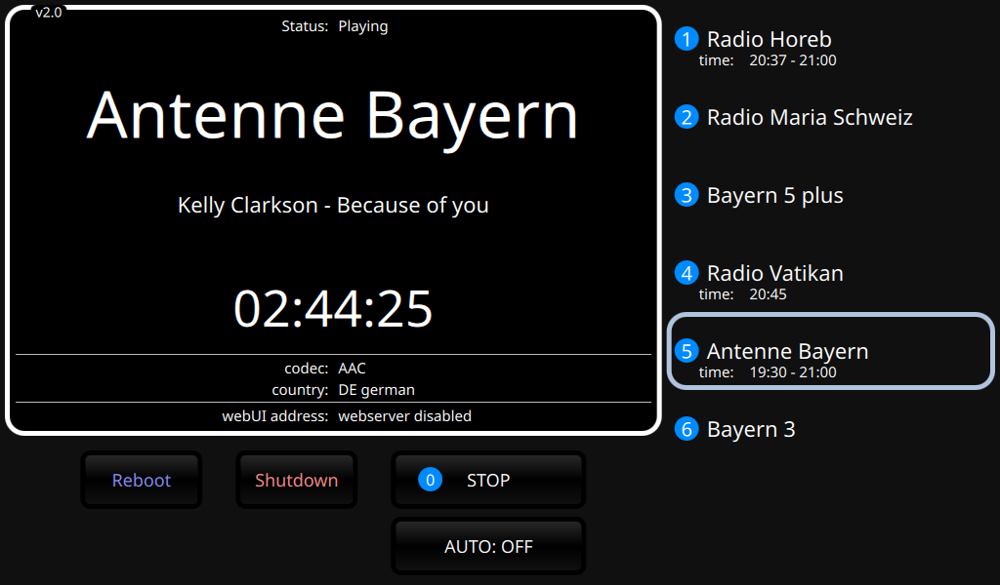
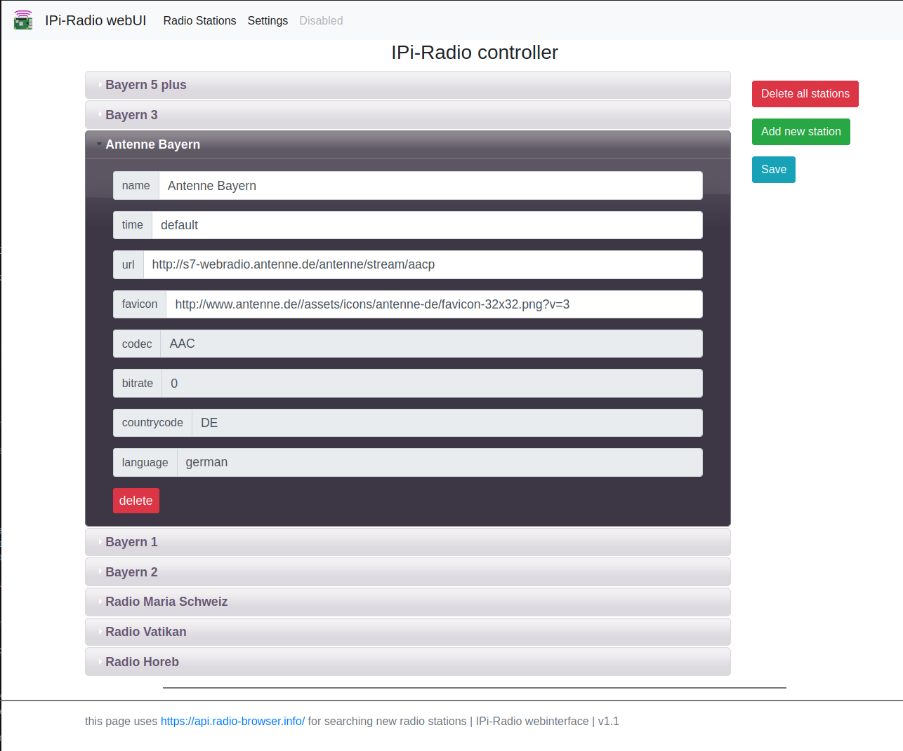
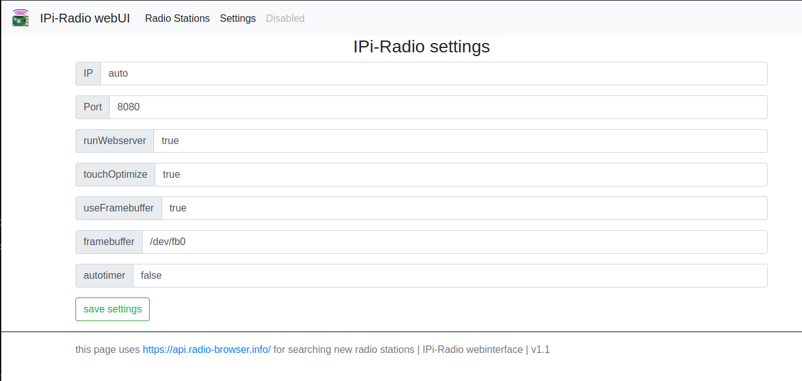

#  IPi-Radio

Simple IP Radio for Raspberry Pi (and any Linux based machine).

## Showcase





## Features

- Play web audio / radio streams
- Navigate using keyboard, remote or touchscreen
- Configure radio stations with the WebUI
- AUTO mode: automatically play specific radio stations at given time frames
- Shows current DLS radio text
- Clock

## How to install (Raspberry Pi)

### Requirements

- Raspberry Pi (tested with 3 and 4)
- Raspberry Pi OS 12 **lite** (Bookworm) or newer
- Network connection
- SDcard >= 4GB
- Screen with at least 800x450 is recommended (touchscreen is optional)
- Python 3.10 or newer

### Pre Install

- `sudo raspi-config`
  - select correct audio device (usually the headphone jack)
  - enable `Console Autologin`
  - set `Network at Boot` to `Yes` if available
  - disable `Screen Blanking`
- make sure all packages are up to date `sudo apt update` and `sudo apt dist-upgrade`
- make sure you have an audio backend / server installed (`alsa` or `pulseaudio` or `pipewire`)
  - `alsa` is recommended as IPi-Radio is the only application playing sound in most use cases
- make sure you are using the KMS dtoverlay in `/boot/config.txt` (should be by default)

### Install IPi-Radio

```bash
# install dependencies
sudo apt install \
  python3 \
  python3-requests \
  python3-pyqt5 \
  python3-pyqt5.qtmultimedia \
  python3-pyqt5.qtquick \
  libqt5multimedia5 \
  libqt5multimedia5-plugins \
  qml-module-qtquick2 \
  qml-module-qtquick-window2 \
  qml-module-qtquick-controls2 \
  qml-module-qtquick-shapes \
  gstreamer1.0-plugins-base \
  gstreamer1.0-plugins-good \
  gstreamer1.0-plugins-rtp \
  gstreamer1.0-libav \
  git

# install audio backend / server
sudo apt install gstreamer1.0-alsa alsa-oss

# reboot
sudo reboot now

# cd to home directory
cd ~

# clone this repo
git clone https://github.com/IPi-Radio/IPi-Radio.git

# "enable" config files inside src/settings
mv settings.json.example settings.json
mv stations.json.example stations.json

# add IPi-Radio to autostart
sudo nano /etc/rc.local
    # insert above(!) the exit 0 statement:
    python3 /path/to/repo/IPi-Radio/src/main.py &
```

### Post Install

optionally you can change some settings, for that you open `src/settings/settings.json`

- change `framebuffer` if you have a screen, that is not using default `/dev/fb0`
- set `IP` or `Port` of the webserver or disable it by setting `runWebserver` to `false`
- change `touchOptimize` to `false` if you don't want touchscreen optimization

you also may want to adjust the brightness of your screen:

**Debian 10** \
`echo n | sudo tee /sys/class/backlight/rpi_backlight/device/backlight/rpi_backlight/brightness`

**Debian 11/12** \
`echo n | sudo tee /sys/class/backlight/10-0045/brightness`

while `n` is a value between 0 and 255

#### For non-Raspberry Pi machines

- change settings in `src/settings/settings.json`
  - set `useFramebuffer` to `false`
  - (optional) set `IP` or `Port` of the webserver
- start with `python3 src/IPi-Radio.py`

### How to update

- navigate into the folder of the cloned repository
- run `git pull`
- done!

### Troubleshooting

#### The clock does not show the correct time
- reconfigure timezone: `sudo dpkg-reconfigure tzdata`

#### Audio very quiet
- install `sudo apt install alsamixergui`
- run `alsamixer`
- use arrows up and down to change output gain (going above 0dB is not recommended)
- exit with `Esc`

## Known issues / limitations

- Drag & Drop in the WebUI leads to unfolding of the draged item
- Only searching by name is possible for now

## Contribute

If you want to help this project, feel free to create a new [issue](https://github.com/IPi-Radio/IPi-Radio/issues) or a [pull request](https://github.com/IPi-Radio/IPi-Radio/pulls).

## Credits

This project is using [segler-alex/radiobrowser-api-rust](https://github.com/segler-alex/radiobrowser-api-rust) via [www.radio-browser.info](https://www.radio-browser.info/#!/), thank you guys for this awesome API!
