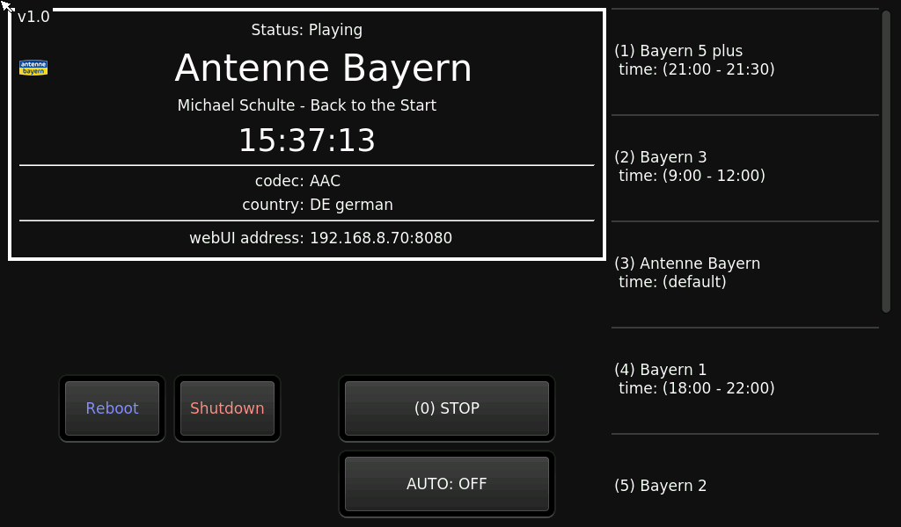

# IPi-Radio-core

Simple and easy IP Radio for Raspberry Pi

## Showcase



## Features

- Play radio streams
- Navigate using keyboard, remote or touchscreen
- Configure radio stations with the WebUI
- AUTO mode: automatically play specific radio stations at given time frames
- Shows current DLS radio text
- Clock

- Liteweight (uses **~20MiB of RAM**)

## How to install (Raspberry Pi)

###### Requirements

- Raspberry Pi (tested on 3 and 4, but older should work too)
- SDcard >= 4GB
- Screen with at least 800x480 is recommended (touchscreen is optional)

###### Pre Install

- Raspberry Pi OS **lite** (without GUI / X server) is recommended
- connect your Pi to the network
- `sudo raspi-config`
  - `1 System Options`
    - `S2 Audio` select the correct audio device (you can also configure audio using `alsamixer`)
    - `S5 Boot / Auto Login` select `B2 Console Autologin`
    - `S6 Network at Boot` select `Yes`
  - `2 Display Options` > `D5 Screen Blanking` select `No`
- make sure all packages are up to date `sudo apt update && sudo apt dist-upgrade`

###### Install IPi-Radio

```bash
# install dependencies
sudo apt install git python3 python3-pyqt5 python3-vlc vlc pulseaudio qt5-style-kvantum qt5-style-plugins
# Note: you will need at least Python 3.6 and vlc 3.0.0

# reboot
sudo reboot now

# clone this repo
git clone https://github.com/IPi-Radio/IPi-Radio.git

# "enable" config files inside src/settings
mv settings.json.example settings.json
mv stations.json.example stations.json

# add IPi-Radio to autostart
sudo nano /etc/rc.local
    # insert above(!) the exit 0 statement:
    python3 /path/to/repo/IPi-Radio/src/IPi-Radio.py
```

###### Post Install

optionally you can change some settings, for that you open `IPi-Radio/src/settings/settings.json`

- change `framebuffer` if you have a screen, that is not using default `/dev/fb0`
- set `IP` or `Port` of the webserver or disable it by setting `runWebserver` to `false`
- change `touchOptimize` to `false` if you don't want touchscreen optimization

you also may want to adjust the brightness of your screen:

`echo n | sudo tee /sys/class/backlight/rpi_backlight/device/backlight/rpi_backlight/brightness`

while `n` is a value between 0 and 255

##### Any Linux powered machine

- change settings in `src/settings/settings.json`
  - set `useFramebuffer` to `false`
  - (optional) set `IP` or `Port` of the webserver
- start with `python3 src/IPi-Radio.py`

### How to update

- navigate into the folder of the cloned repository
- run `git pull`
- done!

### Troubleshooting

- the clock does not show the correct time
  - configure timezone: `sudo dpkg-reconfigure tzdata`

## Known issues / limitations

- Drag & Drop in the WebUI leads to unfolding of the draged item (help needed)
- No visual feedback when searching for new radio stations (planned for next release)
- Only searching by name is possible for now (more to come)
- Radio settings not editable using WebUI (planned for next release)
- No indicator, when new version is available (planned for next release)

Make sure to check out the [GitHub project board](https://github.com/IPi-Radio/IPi-Radio/projects).

## Contribute

If you want to help this project, feel free to create a new [issue](https://github.com/IPi-Radio/IPi-Radio/issues) or a [pull request](https://github.com/IPi-Radio/IPi-Radio/pulls).

## Credits

This project is using [segler-alex/radiobrowser-api-rust](https://github.com/segler-alex/radiobrowser-api-rust) via [www.radio-browser.info](https://www.radio-browser.info/#!/), thank you guys for this awesome API!
